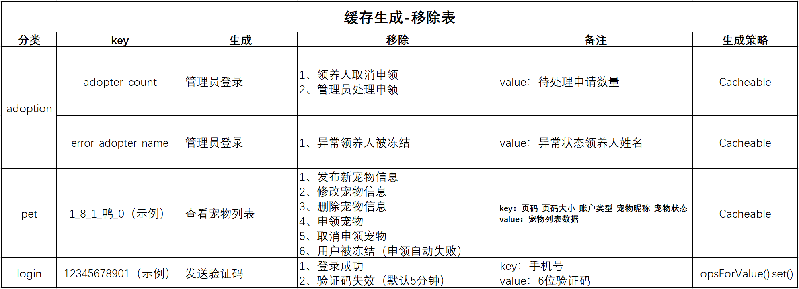

# 宠物领养系统

#### 介绍
毕业设计，宠物领养系统。
用户类型：
    1、管理员：发布、修改宠物信息；发布公告；查看、处理所有的领养记录；修改其它账户状态、类型；
    2、普通用户：查看宠物信息；申领宠物；查看、管理自己的领养记录；修改个人账户信息；
    3、领养人：普通用户领养成功后账户类型变为领养人；在普通用户的基础上增加了发布领养日志功能。

#### 系统架构

后端：jdk8、SpringMvc、Mybatis-Plus、SpringBoot、MySQL、阿里云短信服务
前端：Vue、Element-UI
中间件：Redis

#### 环境准备
编译器：jdk 1.8
数据库：mysql 8 、redis

#### 使用说明

1. 使用idea把项目拉取到本地。
2. 执行sql脚本，初始数据库数据。
3. 配置文件application.yml，修改数据库连接信息
4. 通过启动类PetsAdoptionApplication的main方法启动程序。
5. 访问路径：http://localhost:8080/web/page/login/login.html（地址端口按照自己设置的）

#### 系统运行逻辑：

#### redis缓存设计：
